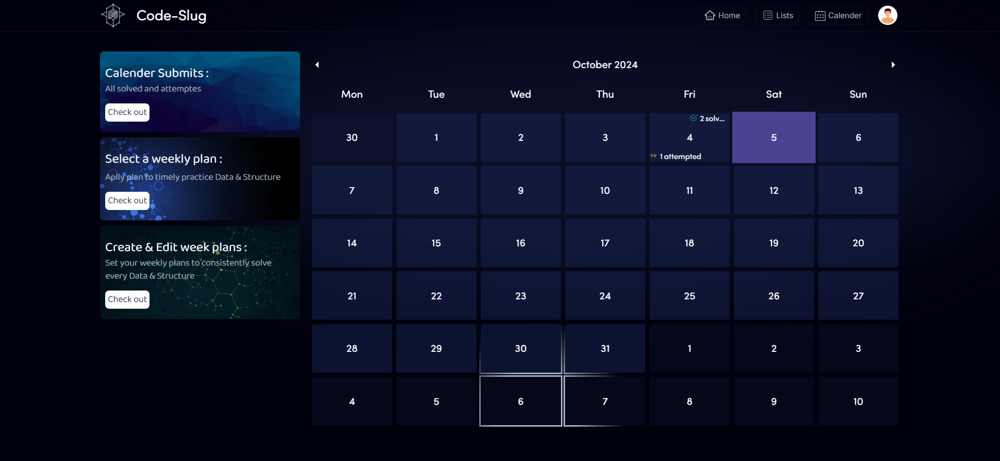
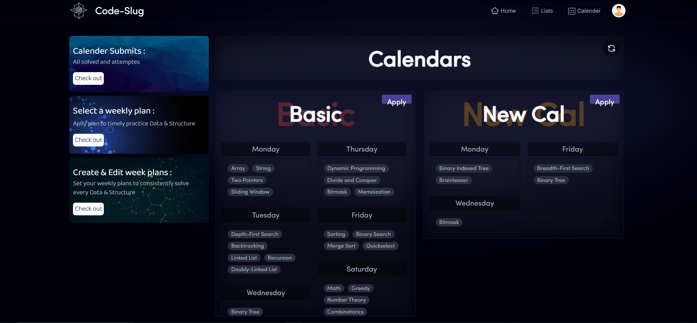
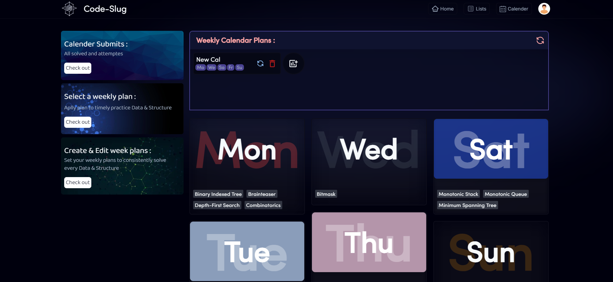

# [Code-Slug](https://codeslug.vercel.app/)


Code-Slug is a coding problem-solving platform built with Next.js, TypeScript, Tailwind CSS, and PostgreSQL (via Supabase). Designed for developers to focus on specific topics and improve their skills, Code-Slug offers a vast problem bank and a unique calendar-based practice feature.

## Features

-  **User Authentication**: Sign in with Google or GitHub via Next-Auth.
-  **2900+ Coding Problems**: Practice problems similar to LeetCode, with more problems to be added from other platforms.
-  **Topic-Based Assignment**: Problems are categorized by 82 topics (e.g., arrays, dynamic programming, graph algorithms).
-  **Problem Feedback**: Users can like/dislike problems, and see the total likes/dislikes for each problem.
-  **Problem Lists**: Create, edit, and delete custom problem lists; a problem can belong to multiple lists.
-  **Filters**: Filter problems by difficulty, status (todo, solved, attempted), and search by name.
-  **Company Tags**: Some problems are tagged with companies that have asked them in interviews, based on public repository data.

## Calendar-Based Practice

-  **Weekly Topic Assignment**: Users can create custom week calendars (Monday to Sunday) and assign specific topics to each day.
-  **Repetition Tracking**: Track previously solved problems by day and week, helping users avoid repeating topics.
-  **Calendar View**: View and manage user-created calendars, including topic assignments for each day of the week.

## Demo


Check out the live demo of Code-Slug [here](https://codeslug.vercel.app//).

## Technologies Used

-  **Next.js**: React-based framework for building server-rendered applications.
-  **Next-Auth**: Authentication for login via Google and GitHub.
-  **TypeScript**: A statically-typed superset of JavaScript.
-  **Tailwind CSS**: Utility-first CSS framework for designing responsive UI.
-  **PostgreSQL (Supabase)**: Database to manage users, problems, topics, and calendars.

## Installation

1. Clone the repository:

   ```
   git clone https://github.com/yourusername/code-slug.git
   ```

2. Navigate to the project folder:

   ```
   cd code-slug
   ```

3. Install dependencies:

   ```
   npm install
   ```

4. Start the development server:

   ```
   npm run dev
   ```

5. Open your browser and visit [http://localhost:3000](http://localhost:3000/) to view the application.

## Usage

1. Sign up for an account or log in if you already have one.
   
2. Start managing your consistant problem solving skills with lists and new feature calendars.

   

   <div style="display: flex; justify-content: space-between; align-items: center; width: 100%; gap: 20px; flex-wrap: wrap;">
      
      
   </div>

## Contributing

Contributions are welcome! Feel free to open issues or submit pull requests to help improve this project.

## License

This project is licensed under the MIT License. See the [LICENSE](./License) file for details.

## Acknowledgments

-  Thanks to the creators of [LeetCode](https://leetcode.com/u/P_Khandal/) for the inspiration.
-  Thanks to [Bennett Dams](https://github.com/vercel/next.js/discussions/47583#discussioncomment-6379219) for useQueryParams().
-  Icons made by [ReactIcons](https://react-icons.github.io/).
